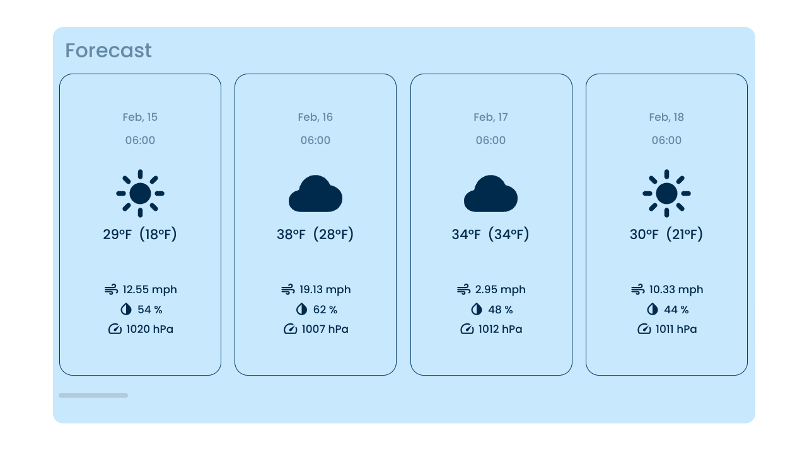
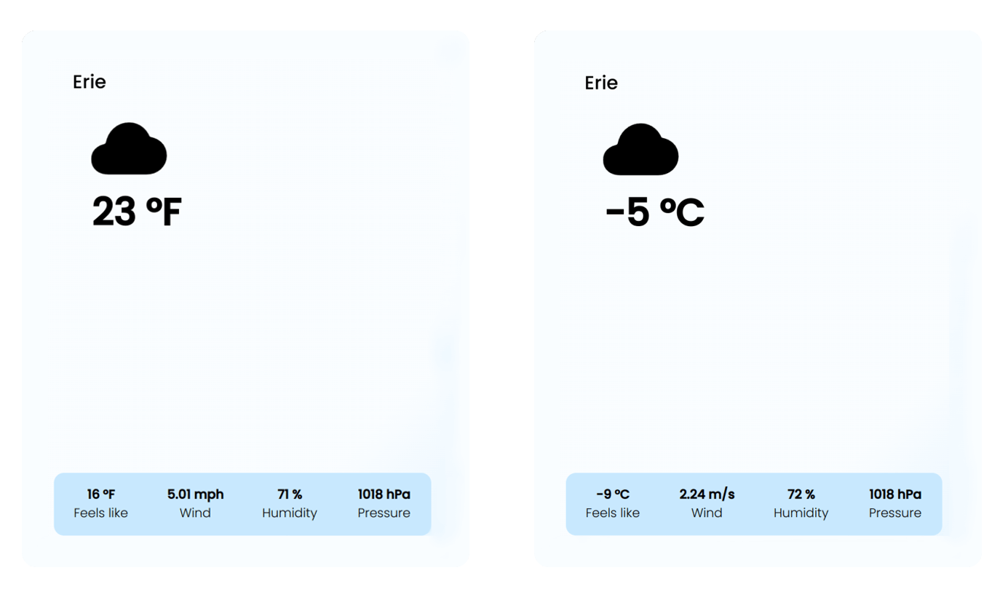
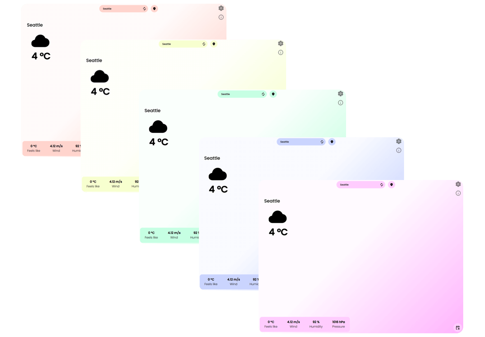
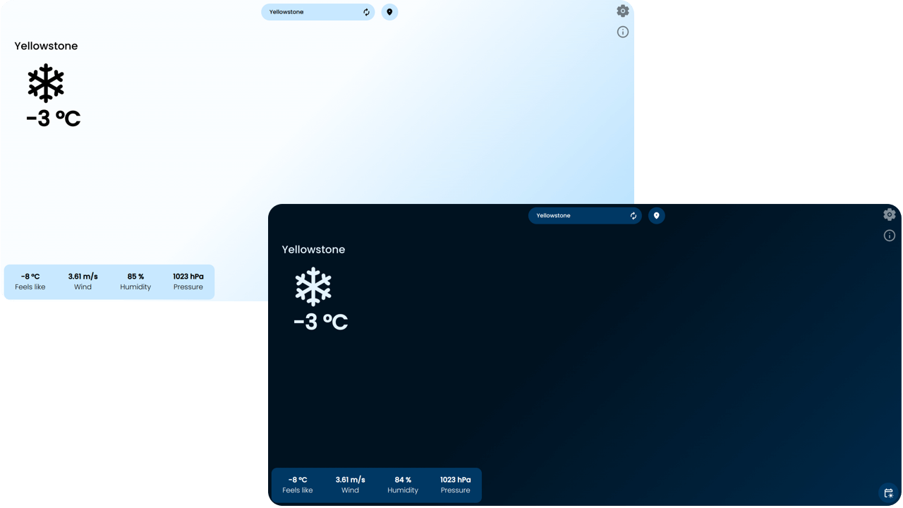

<h1 align="center">YuYu Weather</h1>
<p align="center">Minimal and easy to use weather web app, quick glance at what's above ☀️☁️☔️.</p>

<p align="center">App URL: https://jiayuanwen.github.io/YuYuWeather/</p>

## Features
* ### **Weather info of your current location**
  * Temperature
  * Temperature (Feels Like)
  * Wind Speed
  * Humidity
  * Pressure

* ### **Weather forecast up to 5 days ahead**


* ### **Switch between Metric and Imperial unit for readings**


* ### **Tweak accent color**


* ### **Light/Dark mode support**


* ### **Mobile layouts**


## For devs

<details>
<summary>To run the project</summary>

1. Be sure you have `nodejs` and `git` installed on your system.
2. Go inside the app folder:
    ``` bash
    # Linux
    cd /path/to/YuYuWeather/yuyuweather/

    # Windows
    cd "<Drive Letter>:\path\to\YuYuWeather\"
    ```
3. Install dependencies:
    ``` bash
    npm install
    ```
4. On an internet browser, go to https://openweathermap.org/, and register for an account.
5. Go to https://openweathermap.org/api, click *Subscribe* for **Current Weather Data**, then choose Free tier. Follow any additional steps on-screen. You should then be able to see your API key at https://home.openweathermap.org/api_keys.
6.  Back to your terminal, use a text editor of your choice (`vim`,`nano`,`kim`, etc...) to add a `api.js` file:
    ``` bash
    <text-editor> ./src/components/weather/api.js
    ```
7. Copy this script into `api.js`:
    ``` javascript
    const openweather_api = () => {
        return `API`;
    }

    export {openweather_api};

    ```
    Replace `API` with the API key you got from https://home.openweathermap.org/api_keys. Save the file after making your changes.

8. On your terminal, run the following command to start the project:
    ``` bash
    npm start
    ```
    The app should start on your default browser after a while. If not, on your browser, type in `localhost:3000` on the URL bar. 
    >**Note**
    >
    > Your localhost port is different if you changed it following the *To change localhost port* section.

    From now on, you may repeat the command from step 8 for future testings.


</details>

<details>
<summary>To change localhost port</summary>

### To change localhost port

1. Open `package.json` inside `yuyuweather`.
2. Locate the following line:
    ``` json
    "start": "react-scripts start"
    ```
    Change it to:
    ``` json
    # For Linux & MacOS
    "start": "PORT=<desire_port> react-scripts start"

    # For Windows
    "start": "set PORT=<desire_port> && react-scripts start"
    ```
    And replace `<desire_port>` to your desire port number.

</details>

## Credits
### Modules used
* [React.js](https://react.dev/)
* [Axios](https://axios-http.com/)
* [Universal Cookie](https://www.npmjs.com/package/universal-cookie)
* [React Color](https://casesandberg.github.io/react-color/)
* [Material Web](https://m3.material.io/develop/web)

### Data source
* Weather data obtained from [Open Weather Map](https://openweathermap.org/)
* User location data obtained from [LocationIQ](https://locationiq.com/)

### Visual design
* App visual style mimics [Material You Design by Google](https://design.google/library/making-material-you).
* Feature icons from [Ionicons](https://ionic.io/ionicons) and [Google Material Icons](https://fonts.google.com/icons).

### Special thanks
* [Code Commerce (YouTube)](https://www.youtube.com/@codecommerce) for his amazing React instructions.
